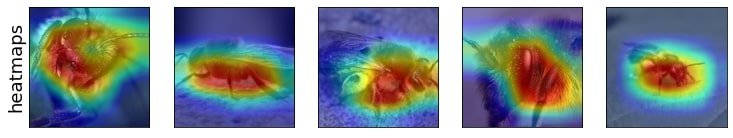

# Welcome to Salient Imagenet


Salient Imagenet is a dataset for testing the sensitivity of neural networks to different features. To achieve this, we first visualize the top-5 features used by a robust neural network to predict some class and annotate each feature as either core/spurious. Next, we add gaussian noise to the regions containing these features and evaluate the model performance on the noisy images to test the model sensitivity to different features.

## Prerequisites

+ Python >= 3.7
+ Pytorch >= 1.9.0
+ PIL >= 8.4.0 
+ clip. Can be installed using ```pip install git+https://github.com/openai/CLIP.git``` 
+ timm >= 0.4.12
+ pandas >= 1.3.1
+ numpy >= 1.21.2
+ cv2 >= 4.5.3


## Setup

+ Load the **Robust Resnet-50 model** using the command given below:   
```wget -O models/robust_resnet50.pth  https://www.dropbox.com/s/knf4uimlqsi1yz8/imagenet_l2_3_0.pt?dl=0```
+ Load the **Salient ImageNet dataset** using [this link](https://umd.box.com/s/eyji8leh2lemhbxovgny9ywc9is53ibr). Unzip the folder using: ```unzip salient_imagenet_dataset.zip```
+ Update ```IMAGENET_PATH``` in ```dataset_paths.py``` to point to the folder containing the ImageNet dataset. The last folder should be ```ILSVRC2012/```.

## Visualizing class and feature pairs

+ Run ```visualize_class_feature_pair.ipynb``` to visualize the feature, class and obtain the Mechanical Turk Worker annotations. 
+ Specify ```class_index, feature_index``` in the jupyter notebook to visualize features in Section J of the paper.
+ Example for ```class_index = 325, feature_index = 595``` given below:


## Visualizing Salient Imagenet

+ Run ```visualize_salient_imagenet.ipynb``` to visualize the images and heatmaps in Salient Imagenet dataset. 
+ Specify ```class_index, feature_index``` in the jupyter notebook to visualize features in Section J of the paper.
+ Example for ```class_index = 309, feature_index = 1941``` given below:



## Testing sensitivity of pretrained models

+ The pretrained models to evaluate are given in the list ```model_name_list``` and standard deviation of Gaussian noise in the list ```noise_stds_list```.
+ Run ```evaluate_sensitivity_single_feature.ipynb``` to test the sensitivity of pretrained models to all 5000 features. 
+ Run ```evaluate_sensitivity_core_features.ipynb``` to test the sensitivity of pretrained models to core features and compute spurious accuracy. 
+ Run ```evaluate_sensitivity_spurious_features.ipynb``` to test the sensitivity of pretrained models to core features and compute core accuracy. 


## Citations

```
@inproceedings{singla2022causal,
  title={Salient ImageNet: How to discover spurious features in Deep Learning?},
  author={Sahil Singla and Soheil Feizi},
  booktitle={International Conference on Learning Representations},
  year={2022},
  url={https://openreview.net/forum?id=XVPqLyNxSyh}
}

@inproceedings{singlaCVPR2021,
  title     = {Understanding Failures of Deep Networks via Robust Feature Extraction},
  author    = {Sahil Singla and Besmira Nushi and Shital Shah and Ece Kamar and Eric Horvitz},
  booktitle = {{IEEE} Conference on Computer Vision and Pattern Recognition, {CVPR} 2021},
  publisher = {Computer Vision Foundation / {IEEE}},
  year      = {2021},
  url       = {https://openaccess.thecvf.com/content/CVPR2021/papers/Singla_Understanding_Failures_of_Deep_Networks_via_Robust_Feature_Extraction_CVPR_2021_paper.pdf},
}

```
