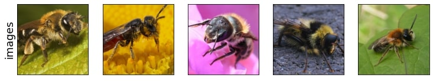
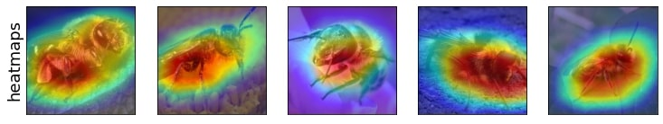

# Salient ImageNet

This repository provides code for the ICLR 2022 paper titled [Salient ImageNet: How to discover spurious features in deep learning?](https://arxiv.org/abs/2110.04301).

## Prerequisites

+ Python >= 3.7
+ Pytorch >= 1.9.0
+ PIL >= 8.4.0 
+ clip. Can be installed using ```pip install git+https://github.com/openai/CLIP.git``` 
+ timm >= 0.4.12
+ pandas >= 1.3.1
+ numpy >= 1.21.2
+ cv2 >= 4.5.3


## Setup

+ Load the **Robust Resnet-50 model** using the command given below:   
```wget -O models/robust_resnet50.pth  https://www.dropbox.com/s/knf4uimlqsi1yz8/imagenet_l2_3_0.pt?dl=0```
+ Load the **Salient ImageNet dataset** using [this link](https://umd.box.com/s/eyji8leh2lemhbxovgny9ywc9is53ibr). 
+ Alternatively, download the **Salient ImageNet dataset** on a remote server using the command given below:   
```curl -L https://umd.app.box.com/shared/static/eyji8leh2lemhbxovgny9ywc9is53ibr -o salient_imagenet_dataset.zip```
+ Unzip the **Salient Imagenet** zip file using: ```unzip salient_imagenet_dataset.zip```
+ Update ```IMAGENET_PATH``` in ```dataset_paths.py``` to the ImageNet dataset (```IMAGENET_PATH``` should end with ```ILSVRC2012/```).
+ NOTE: Some ImageNet versions require the meta.bin file to be placed in the folder ending with ```ILSVRC2012/```. This file meta.bin is also provided in this repo. 

## Visualizing class and feature pairs

+ Run ```visualize_class_feature_pair.ipynb``` to visualize the feature, class and obtain the Mechanical Turk Worker annotations. 
+ Specify ```class_index, feature_index``` in the jupyter notebook to visualize features in Section J of the paper.
+ Example for ```class_index = 325, feature_index = 595``` given below:


## Visualizing Salient Imagenet

+ Run ```visualize_salient_imagenet.ipynb``` to visualize the images and heatmaps in Salient Imagenet dataset. 
+ Specify ```class_index, feature_index``` in the jupyter notebook to visualize features in Section J of the paper.
+ Example for ```class_index = 309, feature_index = 1941``` given below:



## Visualizing class

+ Run ```visualize_class.ipynb``` to visualize the class and top-5 most predictive features for the class.
+ Specify ```class_index``` in the jupyter notebook.
+ Example for ```class_index = 325``` given below:   
Object name(s): sulphur butterfly, sulfur butterfly   
Object supercategory: inverterbrates   
Object definition: any of numerous yellow or orange butterflies    
Object wikipedia link(s): https://en.wikipedia.org/wiki/Coliadinae     
Object images from ImageNet validation set:      


## Testing sensitivity of pretrained models

+ The pretrained models to evaluate are given in the list ```model_name_list``` and standard deviation of Gaussian noise in the list ```noise_stds_list```.
+ Run ```evaluate_sensitivity_single_feature.ipynb``` to test the sensitivity of pretrained models to all 5000 features. 
+ Run ```evaluate_sensitivity_core_features.ipynb``` to test the sensitivity of pretrained models to core features and compute spurious accuracy. 
+ Run ```evaluate_sensitivity_spurious_features.ipynb``` to test the sensitivity of pretrained models to core features and compute core accuracy. 


## Citations

```
@inproceedings{
  singla2022salient,
  title={Salient ImageNet: How to discover spurious features in Deep Learning?},
  author={Sahil Singla and Soheil Feizi},
  booktitle={International Conference on Learning Representations},
  year={2022},
  url={https://openreview.net/forum?id=XVPqLyNxSyh}
}
```
